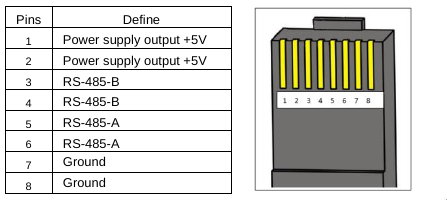
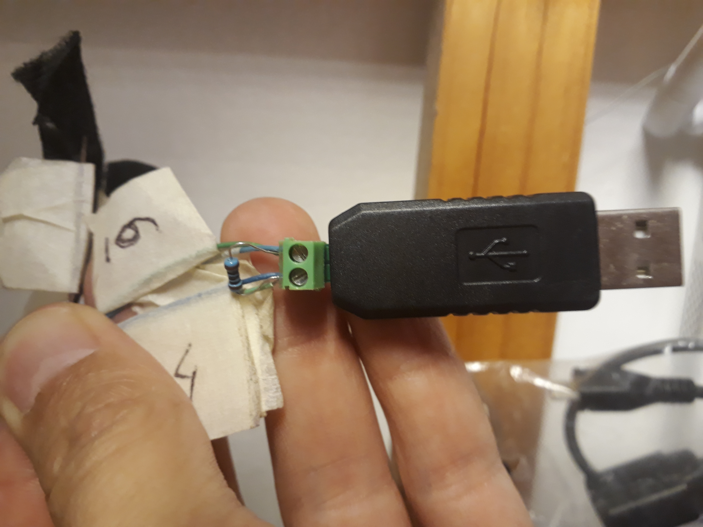

# Epever Tracer 3210a Solar Charge Controller

The current project goal is to generate CSV files with timestamps (UTC) containing extracted data through modbus protocol and an RS485 to USB dongle (about 1USD) connected to a raspberry pi (in my case 3B+)

## Wiring

### Solar controller
With the epever solar tracer 3210a the project extracts data through modbus. The blue ethernet cable you can see below is connected to an RS485 to USB device (see below pictures), which is itself on my case connected to an USB port of a raspberry pi (itself of course solar powered ;))

As the epever_3210a_mppt_solar_charge_controller_manual_en.pdf mentions, the cabling is as following:

+ Only cables 3-4, and 4-5 are used in my case to connect them to the USB adapter. 
+ The 3 and 4 pairs (maybe only one would be enough) is connected to the D- or B (Data minus)
+ The 5 and 6 pairs are connected to the D+ or A (Data plus)
+ Carefull with the 1 and 2 pins which have either 5 or 7.5V, isolate them to avoid short-circuit in your charge-controller
+ I added a 100Ohm resistance between the 2 poles which is recommended by the modbus specs.

### RS-485 to USB Dongle

20210329_180401_rs485-to-usb.jpg)
